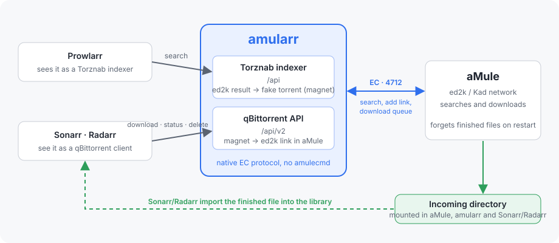

# amularr

*[Español](README.md) · English*

<p align="center">
  
</p>

Bridge between the *arr stack (Prowlarr, Sonarr, Radarr) and aMule.

It speaks aMule's External Connections (EC) protocol natively (no
`amulecmd` parsing) and exposes two HTTP facades:

- **Torznab indexer** (`/api`): every ed2k/Kad search result becomes a
  fake torrent whose info hash embeds the ed2k hash, delivered as a magnet
  link. Add it to Prowlarr as a *Generic Torznab* indexer.
- **qBittorrent Web API v2** (`/api/v2/...`): Sonarr and Radarr use it as
  a regular qBittorrent download client. Magnets coming from the indexer
  are turned back into `ed2k://` links and queued in aMule; progress,
  completion and removal are reported from aMule's download queue.

No third-party Python dependencies.

## How it works

```
Prowlarr ──Torznab──▶ amularr ──EC──▶ amuled  (search)
Sonarr   ──qBittorrent API──▶ amularr ──EC──▶ amuled  (add ed2k link, status, cancel)
Sonarr   ◀── imports finished file from aMule's Incoming directory (shared mount)
```

1. Prowlarr searches. amularr runs the ed2k searches (for an episode
   both `Show S03E03` and `Show 3x03`), waits for the core to finish and
   returns the results as Torznab items with `seeders = sources`.
2. Sonarr picks a release and sends its magnet to the "qBittorrent"
   client. amularr decodes the ed2k hash, name and size from the magnet
   and calls `OP_ADD_LINK` on aMule.
3. Sonarr polls `torrents/info`. amularr maps aMule's part-file status to
   qBittorrent states (`downloading`, `stalledDL`, `pausedDL`, `pausedUP`
   when complete, `error`).
4. When complete, `content_path` points at the file inside aMule's
   Incoming directory. Sonarr imports it and calls `torrents/delete`;
   amularr forgets the entry and, if asked, deletes the file.

Finished files disappear from aMule's queue after a restart, so amularr
keeps its own state file (`AMULARR_STATE_FILE`) and also checks the
Incoming directory on disk.

## Configuration

Environment variables:

| Variable | Default | Description |
| --- | --- | --- |
| `AMULE_EC_HOST` | `127.0.0.1` | aMule host (EC must be enabled in amule.conf) |
| `AMULE_EC_PORT` | `4712` | EC port |
| `AMULE_EC_PASSWORD` | | EC password in clear text (or use the MD5 below) |
| `AMULE_EC_PASSWORD_MD5` | | EC password as MD5 hex, same value as `Password=` in `remote.conf` |
| `AMULARR_LISTEN_HOST` / `AMULARR_LISTEN_PORT` | `0.0.0.0` / `8080` | HTTP bind address |
| `AMULARR_API_KEY` | | Optional Torznab API key |
| `AMULARR_SEARCH_TYPE` | `global` | `global`, `local` or `kad` |
| `AMULARR_SEARCH_TIMEOUT` | `25` | Seconds to wait for a search to finish |
| `AMULARR_SEARCH_CACHE_TTL` | `600` | Seconds a search result set is reused |
| `AMULARR_MIN_SOURCES` | `1` | Drop results with fewer sources |
| `AMULARR_MAX_RESULTS` | `200` | Torznab page size cap |
| `AMULARR_RSS_QUERY` | `1080p` | Keyword search answering RSS requests (no `q`) when nothing was searched recently |
| `AMULARR_FILE_TYPE` | `Video` | ed2k type filter for TV/movie searches (`any` disables) |
| `AMULARR_VIDEO_EXTENSIONS` | mkv avi mp4 ... | Extensions accepted for TV/movie categories |
| `AMULARR_INCOMING_DIR` | aMule's own path | Incoming directory as Sonarr/Radarr see it (`content_path`) |
| `AMULARR_LOCAL_INCOMING_DIR` | same as above | Incoming directory as amularr sees it (completion checks, deletes) |
| `AMULARR_STATE_FILE` | `/data/amularr-state.json` | Persistent state |
| `AMULARR_QBT_USERNAME` / `AMULARR_QBT_PASSWORD` | | Optional credentials for the qBittorrent facade |
| `AMULARR_LOG_LEVEL` | `INFO` | Logging level |
| `AMULARR_SONARR_URL` / `AMULARR_SONARR_API_KEY` | | Enable wanted-list searches for Sonarr (see [docs/usage.md](docs/en/usage.md)) |
| `AMULARR_RADARR_URL` / `AMULARR_RADARR_API_KEY` | | Enable wanted-list searches for Radarr |
| `AMULARR_WANTED_DAYS` | `7` | Only search items aired/released (or added) within this many days |
| `AMULARR_WANTED_INTERVAL` | `900` | Seconds between two reads of the wanted lists |
| `AMULARR_WANTED_RESEARCH_INTERVAL` | `21600` | Seconds before a still-wanted item is searched again |
| `AMULARR_WANTED_MAX_SEARCHES` | `30` | Keyword searches per refresh (each takes `AMULARR_SEARCH_TIMEOUT` at most) |
| `AMULARR_WANTED_MAX_TITLES` | `3` | Titles tried per item (main title plus alternate/scene titles) |
| `AMULARR_WANTED_TITLE_LANGUAGES` | `spanish` | Radarr alternate-title languages to search with |

See [docs/usage.md](docs/en/usage.md#4-wanted-list-searches-automatic-grabs) for how the wanted-list searches make automatic grabs work.

## Installation

Images for `linux/amd64` and `linux/arm64` are published at
`ghcr.io/manuel-alcocer/amularr` (`0.2.0`, `0.2`, `latest`, and `main` for the
development branch).

- **Docker / docker compose**: [docs/install-docker.md](docs/en/install-docker.md),
  example stack in [deploy/docker-compose.yml](deploy/docker-compose.yml).
- **Kubernetes**: [docs/install-kubernetes.md](docs/en/install-kubernetes.md),
  manifest in [deploy/kubernetes/amularr.yaml](deploy/kubernetes/amularr.yaml).
- **Wiring Prowlarr, Sonarr and Radarr**, routing, wanted-list searches and
  troubleshooting: [docs/usage.md](docs/en/usage.md).

Quick start with an aMule already running on `192.168.1.12`:

```bash
docker run -d --name amularr -p 8080:8080 --user 1000:100 \
  -e AMULE_EC_HOST=192.168.1.12 -e AMULE_EC_PASSWORD=secret \
  -e AMULARR_INCOMING_DIR=/amule/incoming \
  -v amularr-data:/data -v /srv/amule/incoming:/amule/incoming \
  ghcr.io/manuel-alcocer/amularr:0.2.0
```

Then add `http://amularr:8080` as a *Generic Torznab* indexer in Prowlarr
and as a *qBittorrent* download client in Sonarr/Radarr, and set the
indexer's *Download Client* to it.

## Development

```bash
pip install -e .[dev]
pytest
```

Local multi-arch build:

```bash
docker buildx build --platform linux/amd64,linux/arm64 -t ghcr.io/manuel-alcocer/amularr:dev .
```

### Releasing

The GitHub Actions workflow in `.github/workflows/build.yml` runs the tests
on every push and pull request, builds the image for `linux/amd64` and
`linux/arm64`, and pushes it to GHCR on pushes to `main` (tag `main`) and on
tags `v*` (tags `X.Y.Z`, `X.Y`, `latest`). A release is:

```bash
# bump version in pyproject.toml and amularr/__init__.py, commit, then
git tag v0.2.0 && git push origin main v0.2.0
```

The workflow refuses a tag that does not match `amularr.__version__`.

`amularr/ec/` is a standalone implementation of the EC protocol (packet
framing, UTF-8 numbers, zlib, salted MD5 handshake) that can be reused for
other aMule tooling.
